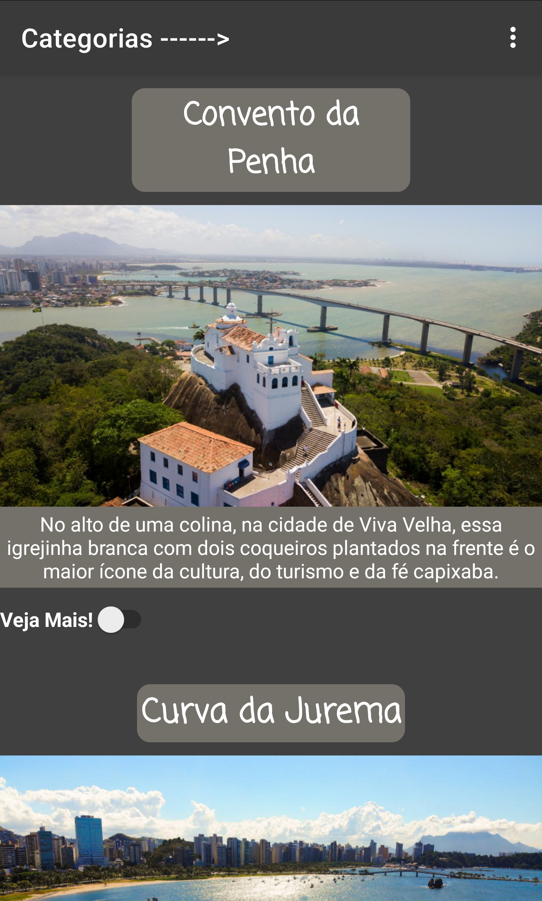
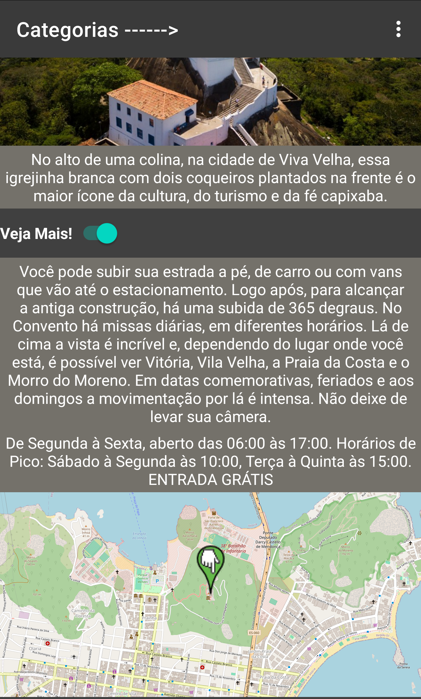
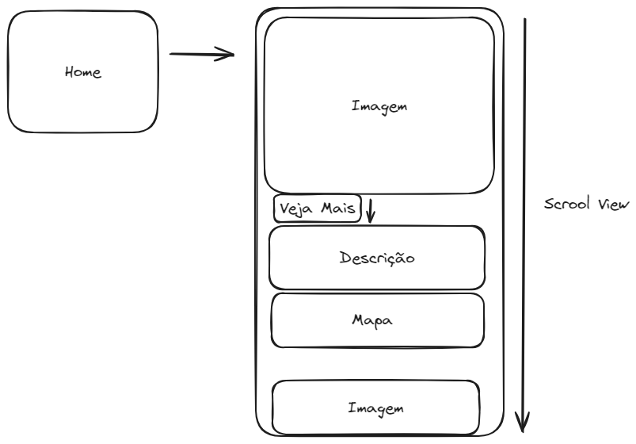

<h1 align="center">VixTur</h1>

<p align="center">
  <a href="https://opensource.org/licenses/Apache-2.0"></a>
  <a href="https://android-arsenal.com/api?level=21"></a>  <br>
  <a href="https://wa.me/+5527997949811"></a>
  <a href="https://www.linkedin.com/in/fabricionascimentoaleixo/"></a>
  <a href="mailto:fabricioaleixo12@gmail.com"></a>
</p>

<p align="center">  

⭐ Esse é um projeto para demonstrar meu conhecimento técnico no desenvolvimento Android nativo com Java. Mais informações técnicas abaixo.

Aplicativo estilo Instagram de visualização de pontos turísticos, possuindo integração do Firebase para armazenamento das imagens em cache de memória e uso da API do OpenStreetMap para localização.

</p>

</br>

<p float="left" align="center">
    
    
    
</p>

## Download
<a href="apk/app-debug.apk?raw=true">Baixe aqui o APK</a>. Você pode ver <a href="https://www.google.com/search?q=como+instalar+um+apk+no+android">aqui</a> como instalar uma APK no seu aparelho android.

## Tecnologias usadas e bibliotecas de código aberto

- Minimum SDK level: 21
- [Linguagem Java](https://www.java.com/)

- Firebase
  - Armazenamento em Nuvem (Cloud Storage):
    O Firebase oferece armazenamento em nuvem para seus aplicativos Android. Isso permite que você armazene e recupere dados, como imagens, vídeos e outros arquivos, de forma eficiente e escalável.

- OpenStreetMap 
  - OSM é um projeto colaborativo de mapeamento geoespacial que visa criar um mapa mundial gratuito e editável.
    
## Arquitetura
**VixTur** utiliza a arquitetura MVVM e o padrão de Repositories, que segue as [recomendações oficiais do Google](https://developer.android.com/topic/architecture).
</br></br>

<br>

## API de terceiros

- Vixtur usa a [OpenStreetMap](https://www.openstreetmap.org/) para trazer os mapas das localizações<br>
  - OpenStreetMap é um projeto colaborativo de mapeamento geoespacial que visa criar um mapa mundial gratuito e editável.
  
## Features

### Imagens em Cache


Ao abrir a listagem dos pontos as imagens sao buscadas pelo banco do firebase e sao armazenadas em cache da memoria do celular.

### Mapas


O Veja Mais de cada ponto turístico mostra o mapa o ponto de sua geolocalização.

# Licença
```xml
Copyright [2023] [Fabricio Nascimento Aleixo]

Licensed under the Apache License, Version 2.0 (the "License");
you may not use this file except in compliance with the License.
You may obtain a copy of the License at

   http://www.apache.org/licenses/LICENSE-2.0

Unless required by applicable law or agreed to in writing, software
distributed under the License is distributed on an "AS IS" BASIS,
WITHOUT WARRANTIES OR CONDITIONS OF ANY KIND, either express or implied.
See the License for the specific language governing permissions and
limitations under the License.
```
